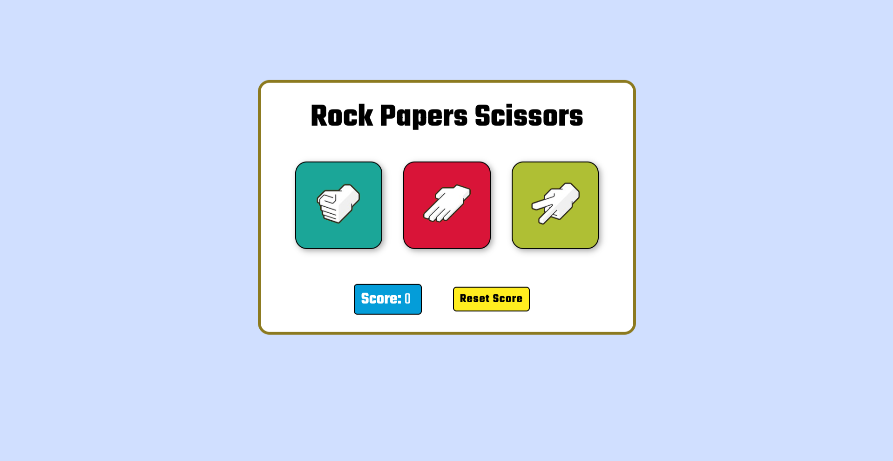

# Rock Paper Scissors 
A web based rock paper scissors game with AI mode.

## [Live Preview](https://malihassandev.github.io/Rock-Papper-Scissors/)

## Features
- Play against AI
- Score Tracking
- Input validation
- Clean interface
## Game Rules
- Choose between Rock (1), Paper (2), or Scissors (3)
- Computer randomly selects its move
- Score is tracked for each round
- Press reset to reset the score
## Winning Logic
- Rock beats Scissors
- Scissors beats Paper
- Paper beats Rock
- Same choice result in tie
## Tech Stack
- Html 
- Javascript
- Css
## Outcome
- Learned about dynamically changing the UI based on user interaction
- Improved skills in handling user input and validation
- Learned implementation of random number generation
- Enhanced understanding of conditional statements
- Applied functions/methods for reusable code
## Navigation
- My next project [Calculator](https://github.com/MAliHassanDev/Calculator)